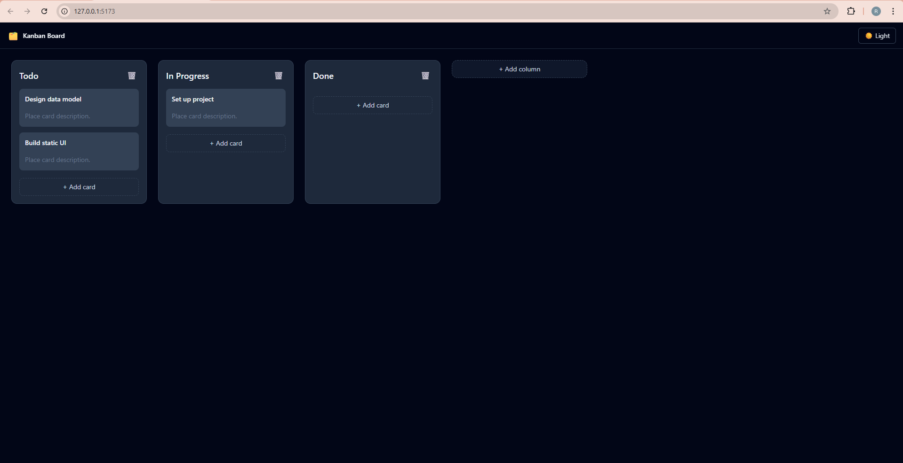

# 🗂 Kanban Board
A Trello-inspired Kanban board built with React and TypeScript, focused on clean state management, scalable architecture, and polished user experience.

---

## 🚀 Live Demo
- 👉 Live: https://kanban-board-virid-two.vercel.app/
- 👉 Portfolio: https://renzoyano.vercel.app/

---

## 🛠 Tech Stack
- React + TypeScript
- Tailwind CSS
- @dnd-kit
- Vitest
- Vite

--- 

## ✨ Features
- Create, rename, and delete columns
- Create, edit, and delete cards
- Drag & drop cards between columns
- Inline editing with keyboard support
- Dark mode with strong visual contrast
- Persistent state using localStorage
- Responsive horizontal board layout

---

## 📸 Preview


---

## 🧠 Architecture
The application uses a reducer-driven architecture inspired by production frontend codebases.
### State Management
- useReducer for predictable state transitions
- Normalized state shape:
```text
columns
cards
columnOrder
```
- All mutations are handled through explicit reducer actions
- State is persisted automatically via localStorage

This approach keeps updates deterministic and makes future features such as undo/redo or column reordering straightforward to add.

---

## 🧩 Providers
- BoardProvider
Manages domain state (columns, cards, card drag & drop logic)
- ThemeProvider
Handles global UI state (dark/light mode) and persists user preference

Separating providers keeps business logic decoupled from UI concerns.

---

## 🎨 Design Decisions
- Dark mode is implemented as a layered surface system rather than a color inversion, ensuring strong contrast and readability
- Global layout concerns live at the app shell level
- Column and card actions remain contextual to reduce cognitive load
- Inline editing supports keyboard controls (Enter / Escape)

---

## 🧪 Testing
Reducer logic is covered by unit tests using Vitest, ensuring predictable state transitions and safe refactoring.

---

## 🚀 Future Improvements
- Column drag & reorder
- Undo / redo support
- Multi-board support
- Accessibility audit
- Performance optimizations for large boards

---
